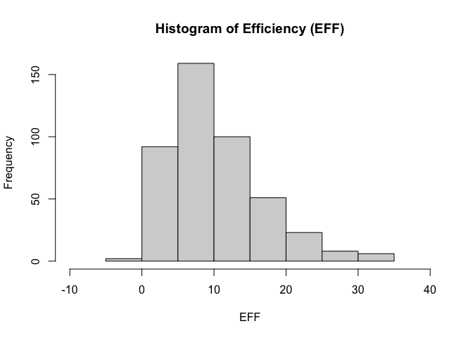
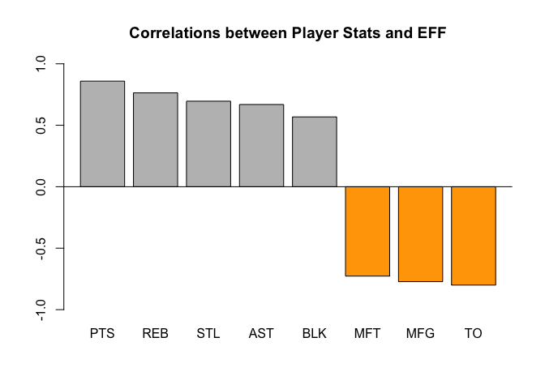
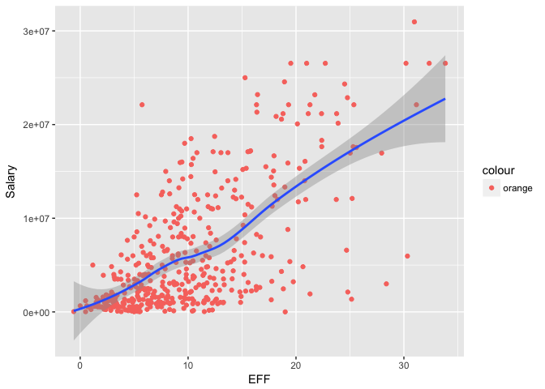
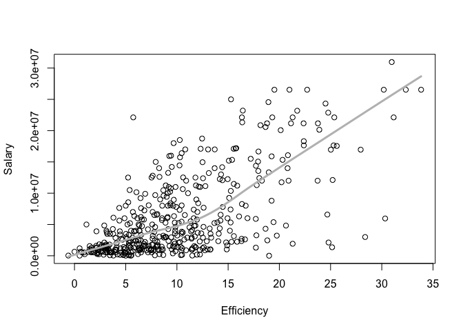
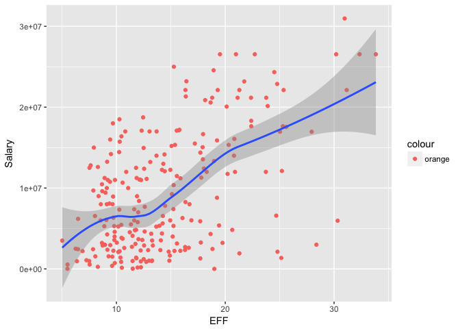

ggplot proj
================
Yoon Sung Hong
9/26/2017

``` r
library(readr)
library(ggplot2)
library(dplyr)
```

    ## 
    ## Attaching package: 'dplyr'

    ## The following objects are masked from 'package:stats':
    ## 
    ##     filter, lag

    ## The following objects are masked from 'package:base':
    ## 
    ##     intersect, setdiff, setequal, union

``` r
setwd("~/stat133/stat133-hws-fall17/hw02")
```

Import the data in R
--------------------

``` r
dat <- read.csv("./data/nba2017-player-statistics.csv", header = TRUE,
                colClasses = c("Player" = "character",
                               "Team" = "character",
                               "Experience" = "character",
                                "Position" = "factor",
                                "Salary" = "double"
                                ))
str(dat)
```

    ## 'data.frame':    441 obs. of  24 variables:
    ##  $ Player      : chr  "Al Horford" "Amir Johnson" "Avery Bradley" "Demetrius Jackson" ...
    ##  $ Team        : chr  "BOS" "BOS" "BOS" "BOS" ...
    ##  $ Position    : Factor w/ 5 levels "C","PF","PG",..: 1 2 5 3 4 3 4 5 4 2 ...
    ##  $ Experience  : chr  "9" "11" "6" "R" ...
    ##  $ Salary      : num  26540100 12000000 8269663 1450000 1410598 ...
    ##  $ Rank        : int  4 6 5 15 11 1 3 13 8 10 ...
    ##  $ Age         : int  30 29 26 22 31 27 26 21 20 29 ...
    ##  $ GP          : int  68 80 55 5 47 76 72 29 78 78 ...
    ##  $ GS          : int  68 77 55 0 0 76 72 0 20 6 ...
    ##  $ MIN         : int  2193 1608 1835 17 538 2569 2335 220 1341 1232 ...
    ##  $ FGM         : int  379 213 359 3 95 682 333 25 192 114 ...
    ##  $ FGA         : int  801 370 775 4 232 1473 720 58 423 262 ...
    ##  $ Points3     : int  86 27 108 1 39 245 157 12 46 45 ...
    ##  $ Points3_atts: int  242 66 277 1 111 646 394 35 135 130 ...
    ##  $ Points2     : int  293 186 251 2 56 437 176 13 146 69 ...
    ##  $ Points2_atts: int  559 304 498 3 121 827 326 23 288 132 ...
    ##  $ FTM         : int  108 67 68 3 33 590 176 6 85 26 ...
    ##  $ FTA         : int  135 100 93 6 41 649 217 9 124 37 ...
    ##  $ OREB        : int  95 117 65 2 17 43 48 6 45 60 ...
    ##  $ DREB        : int  369 248 269 2 68 162 367 20 175 213 ...
    ##  $ AST         : int  337 140 121 3 33 449 155 4 64 71 ...
    ##  $ STL         : int  52 52 68 0 9 70 72 10 35 26 ...
    ##  $ BLK         : int  87 62 11 0 7 13 23 2 18 17 ...
    ##  $ TO          : int  116 77 88 0 25 210 79 4 68 39 ...

``` r
dat_2 <- read_csv("./data/nba2017-player-statistics.csv",
                  col_types = list(.default = col_integer(),
                                   Player = col_character(), 
                                   Team = col_character(), 
                                   Experience = col_character(),
                                   Position = col_factor(c("C","PF","PG","SF","SG")),
                                   Salary = col_double()))
str(dat_2)
```

    ## Classes 'tbl_df', 'tbl' and 'data.frame':    441 obs. of  24 variables:
    ##  $ Player      : chr  "Al Horford" "Amir Johnson" "Avery Bradley" "Demetrius Jackson" ...
    ##  $ Team        : chr  "BOS" "BOS" "BOS" "BOS" ...
    ##  $ Position    : Factor w/ 5 levels "C","PF","PG",..: 1 2 5 3 4 3 4 5 4 2 ...
    ##  $ Experience  : chr  "9" "11" "6" "R" ...
    ##  $ Salary      : num  26540100 12000000 8269663 1450000 1410598 ...
    ##  $ Rank        : int  4 6 5 15 11 1 3 13 8 10 ...
    ##  $ Age         : int  30 29 26 22 31 27 26 21 20 29 ...
    ##  $ GP          : int  68 80 55 5 47 76 72 29 78 78 ...
    ##  $ GS          : int  68 77 55 0 0 76 72 0 20 6 ...
    ##  $ MIN         : int  2193 1608 1835 17 538 2569 2335 220 1341 1232 ...
    ##  $ FGM         : int  379 213 359 3 95 682 333 25 192 114 ...
    ##  $ FGA         : int  801 370 775 4 232 1473 720 58 423 262 ...
    ##  $ Points3     : int  86 27 108 1 39 245 157 12 46 45 ...
    ##  $ Points3_atts: int  242 66 277 1 111 646 394 35 135 130 ...
    ##  $ Points2     : int  293 186 251 2 56 437 176 13 146 69 ...
    ##  $ Points2_atts: int  559 304 498 3 121 827 326 23 288 132 ...
    ##  $ FTM         : int  108 67 68 3 33 590 176 6 85 26 ...
    ##  $ FTA         : int  135 100 93 6 41 649 217 9 124 37 ...
    ##  $ OREB        : int  95 117 65 2 17 43 48 6 45 60 ...
    ##  $ DREB        : int  369 248 269 2 68 162 367 20 175 213 ...
    ##  $ AST         : int  337 140 121 3 33 449 155 4 64 71 ...
    ##  $ STL         : int  52 52 68 0 9 70 72 10 35 26 ...
    ##  $ BLK         : int  87 62 11 0 7 13 23 2 18 17 ...
    ##  $ TO          : int  116 77 88 0 25 210 79 4 68 39 ...
    ##  - attr(*, "spec")=List of 2
    ##   ..$ cols   :List of 24
    ##   .. ..$ Player      : list()
    ##   .. .. ..- attr(*, "class")= chr  "collector_character" "collector"
    ##   .. ..$ Team        : list()
    ##   .. .. ..- attr(*, "class")= chr  "collector_character" "collector"
    ##   .. ..$ Position    :List of 3
    ##   .. .. ..$ levels    : chr  "C" "PF" "PG" "SF" ...
    ##   .. .. ..$ ordered   : logi FALSE
    ##   .. .. ..$ include_na: logi FALSE
    ##   .. .. ..- attr(*, "class")= chr  "collector_factor" "collector"
    ##   .. ..$ Experience  : list()
    ##   .. .. ..- attr(*, "class")= chr  "collector_character" "collector"
    ##   .. ..$ Salary      : list()
    ##   .. .. ..- attr(*, "class")= chr  "collector_double" "collector"
    ##   .. ..$ Rank        : list()
    ##   .. .. ..- attr(*, "class")= chr  "collector_integer" "collector"
    ##   .. ..$ Age         : list()
    ##   .. .. ..- attr(*, "class")= chr  "collector_integer" "collector"
    ##   .. ..$ GP          : list()
    ##   .. .. ..- attr(*, "class")= chr  "collector_integer" "collector"
    ##   .. ..$ GS          : list()
    ##   .. .. ..- attr(*, "class")= chr  "collector_integer" "collector"
    ##   .. ..$ MIN         : list()
    ##   .. .. ..- attr(*, "class")= chr  "collector_integer" "collector"
    ##   .. ..$ FGM         : list()
    ##   .. .. ..- attr(*, "class")= chr  "collector_integer" "collector"
    ##   .. ..$ FGA         : list()
    ##   .. .. ..- attr(*, "class")= chr  "collector_integer" "collector"
    ##   .. ..$ Points3     : list()
    ##   .. .. ..- attr(*, "class")= chr  "collector_integer" "collector"
    ##   .. ..$ Points3_atts: list()
    ##   .. .. ..- attr(*, "class")= chr  "collector_integer" "collector"
    ##   .. ..$ Points2     : list()
    ##   .. .. ..- attr(*, "class")= chr  "collector_integer" "collector"
    ##   .. ..$ Points2_atts: list()
    ##   .. .. ..- attr(*, "class")= chr  "collector_integer" "collector"
    ##   .. ..$ FTM         : list()
    ##   .. .. ..- attr(*, "class")= chr  "collector_integer" "collector"
    ##   .. ..$ FTA         : list()
    ##   .. .. ..- attr(*, "class")= chr  "collector_integer" "collector"
    ##   .. ..$ OREB        : list()
    ##   .. .. ..- attr(*, "class")= chr  "collector_integer" "collector"
    ##   .. ..$ DREB        : list()
    ##   .. .. ..- attr(*, "class")= chr  "collector_integer" "collector"
    ##   .. ..$ AST         : list()
    ##   .. .. ..- attr(*, "class")= chr  "collector_integer" "collector"
    ##   .. ..$ STL         : list()
    ##   .. .. ..- attr(*, "class")= chr  "collector_integer" "collector"
    ##   .. ..$ BLK         : list()
    ##   .. .. ..- attr(*, "class")= chr  "collector_integer" "collector"
    ##   .. ..$ TO          : list()
    ##   .. .. ..- attr(*, "class")= chr  "collector_integer" "collector"
    ##   ..$ default: list()
    ##   .. ..- attr(*, "class")= chr  "collector_integer" "collector"
    ##   ..- attr(*, "class")= chr "col_spec"

> The rest of the 19 columns are already classified as **integer**, as shown from the `str()` function.

Right after importing the data
------------------------------

``` r
#Replacing R's with 0's and converting the variable to integer
dat$Experience <- as.integer(replace(dat$Experience, grep("R", dat$Experience), "0"))
is.integer(dat$Experience)
```

    ## [1] TRUE

Performance of players
----------------------

``` r
#Adding variables
MFG <- (dat$FGA) - (dat$FGM)
MFT <- (dat$FTA)-(dat$FTM)
PTS <- (3*(dat$Points3))+(2*(dat$Points2))+(dat$FTM)
REB <- (dat$DREB)+(dat$OREB)
MPG <- (dat$MIN)/(dat$GP)
dat$MFG <- MFG
dat$MFT <- MFT
dat$PTS <- PTS
dat$REB <- REB
dat$MPG <- MPG
#Forming [EFF value](https://en.wikipedia.org/wiki/Efficiency_(basketball))
dat$EFF <- ((dat$PTS)+(dat$REB)+(dat$AST)+(dat$STL)+(dat$BLK)-(dat$MFG)-(dat$MFT)-(dat$TO))/(dat$GP)
#Summary
summary(dat$EFF)
```

    ##    Min. 1st Qu.  Median    Mean 3rd Qu.    Max. 
    ##  -0.600   5.452   9.090  10.137  13.247  33.840

``` r
#Histogram
hist(dat$EFF, xlab = "EFF", xlim = c(-10, 40), main = "Histogram of Efficiency (EFF)", col = "light grey")
```



``` r
#Top 10 EFF-valued players
dat[order(-dat$EFF),][(1:10), c("Player", "Team", "Salary", "EFF")]
```

    ##                    Player Team   Salary      EFF
    ## 305     Russell Westbrook  OKC 26540100 33.83951
    ## 256          James Harden  HOU 26540100 32.34568
    ## 355         Anthony Davis  NOP 22116750 31.16000
    ## 28           LeBron James  CLE 30963450 30.97297
    ## 404    Karl-Anthony Towns  MIN  5960160 30.32927
    ## 228          Kevin Durant  GSW 26540100 30.19355
    ## 74  Giannis Antetokounmpo  MIL  2995421 28.37500
    ## 359      DeMarcus Cousins  NOP 16957900 27.94118
    ## 110          Jimmy Butler  CHI 17552209 25.60526
    ## 119      Hassan Whiteside  MIA 22116750 25.36364

``` r
#Names of players with negative EFF values
dat[dat$EFF < 0, "Player"]
```

    ## [1] "Patricio Garino"

``` r
#Finding correlations
cor(dat$EFF, dat$PTS)
```

    ## [1] 0.8588644

``` r
cor(dat$EFF, dat$REB)
```

    ## [1] 0.7634501

``` r
cor(dat$EFF, dat$AST)
```

    ## [1] 0.6689232

``` r
cor(dat$EFF, dat$STL)
```

    ## [1] 0.6957286

``` r
cor(dat$EFF, dat$BLK)
```

    ## [1] 0.5679571

``` r
cor(dat$EFF, -dat$MFG)
```

    ## [1] -0.7722477

``` r
cor(dat$EFF, -dat$MFT)
```

    ## [1] -0.7271456

``` r
cor(dat$EFF, -dat$TO)
```

    ## [1] -0.8003289

``` r
#Displaying correlations in descending order
cor_PTS <-cor(dat$EFF, dat$PTS)
cor_REB <- cor(dat$EFF, dat$REB)
cor_AST <- cor(dat$EFF, dat$AST)
cor_STL <- cor(dat$EFF, dat$STL)
cor_BLK <- cor(dat$EFF, dat$BLK)
cor_MFG <- cor(dat$EFF, -dat$MFG)
cor_MFT <- cor(dat$EFF, -dat$MFT)
cor_TO <- cor(dat$EFF, -dat$TO)
correlations <- data.frame(player.stats = 
                             c("PTS", "REB", "AST", "STL", "BLK", "MFG", "MFT", "TO"),
                           cor = c(cor_PTS, cor_REB, cor_AST, cor_STL, cor_BLK, cor_MFG, cor_MFT, cor_TO))
correlations <- correlations[order(-correlations$cor),]
correlations
```

    ##   player.stats        cor
    ## 1          PTS  0.8588644
    ## 2          REB  0.7634501
    ## 4          STL  0.6957286
    ## 3          AST  0.6689232
    ## 5          BLK  0.5679571
    ## 7          MFT -0.7271456
    ## 6          MFG -0.7722477
    ## 8           TO -0.8003289

``` r
#Barplot
barplot(correlations$cor, ylim = c(-1, 1),
        main = "Correlations between Player Stats and EFF", 
        col = c("orange", "grey")[(correlations$cor>0)+1],
        names.arg = correlations$player.stats)
abline(h=0)
```



Efficiency and Salary
---------------------

``` r
#Plotting scatter with lowess using ggplot
ggplot(data = dat, aes(x = EFF, y = Salary)) + geom_point(aes(color = "orange")) + geom_smooth()
```

    ## `geom_smooth()` using method = 'loess'



``` r
#Plotting scatter with lowess using the more traditional method
plot(dat$EFF, dat$Salary, xlab = "Efficiency", ylab = "Salary")
lines(lowess(dat$EFF, dat$Salary, f = 0.7), col = "Grey", lwd = 3)
```



``` r
#Correlation coefficient between EFF and salary
cor(dat$EFF, dat$Salary)
```

    ## [1] 0.655624

> Positive correlation between EFF and Salary indicate that generally, higher efficiency from a player is responded through higher salary. The degree to which the two variables correlate is pretty significant, represented by the value of ~0.656.

``` r
#more "solid" players
player2 <- dat[dat$MPG >= 20,]
#scatterplot
ggplot(data = player2, aes(x = EFF, y = Salary)) + geom_point(aes(color = "orange")) + geom_smooth()
```

    ## `geom_smooth()` using method = 'loess'



``` r
#correlation coefficient
cor(player2$EFF, player2$Salary)
```

    ## [1] 0.5367224

> Positive correlation between EFF and Salary (for players with playtime per game over 20 minutes) indicate that generally, higher efficiency from a player is responded through higher salary. The degree to which the two variables correlate is pretty significant, but not as significant as the correlation representation based on all NBA players. The correlation value's significance is represented by the value of ~0.537.
